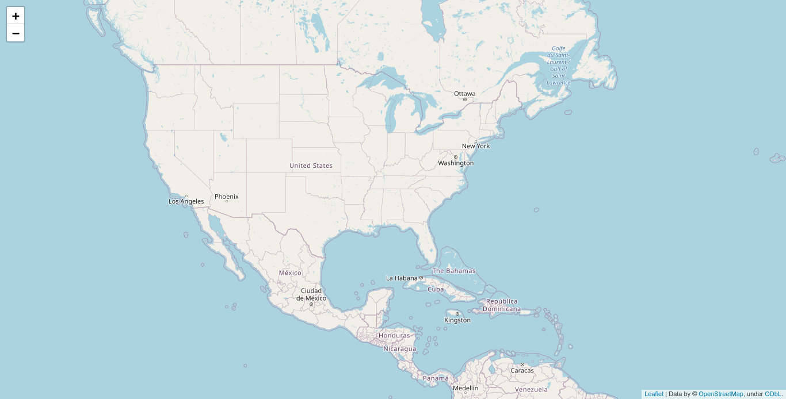
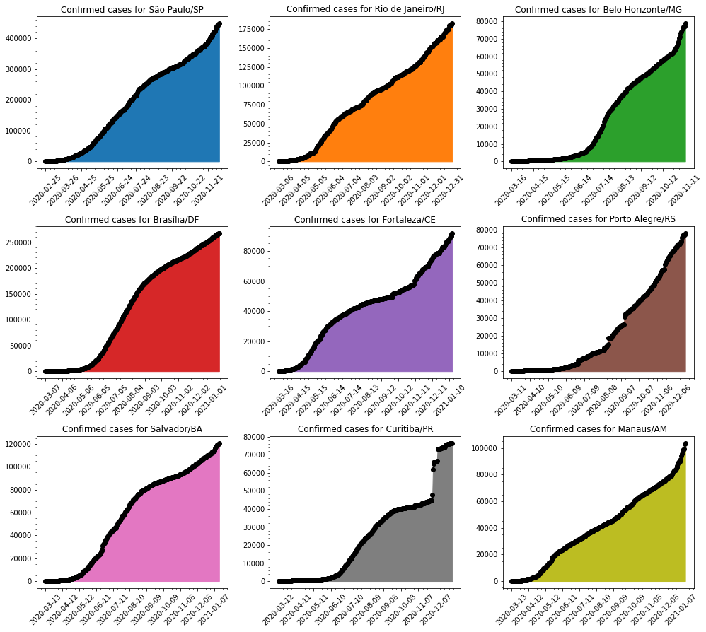

## COVID-19 Statistics

Simple repository to explore and show data about the new pandemic virus Corona Virus.

### Datasets

- World Data at: https://github.com/CSSEGISandData/COVID-19

- Brazil Data at: https://github.com/wcota/covid19br

- Brazil Population and other informations: https://www.ibge.gov.br/estatisticas/sociais/populacao.html

- World Population: https://www.worldometers.info/world-population/population-by-country/

- [Impact of non-pharmaceutical interventions (NPIs) to reduce COVID-19 mortality and healthcare demand](https://www.imperial.ac.uk/media/imperial-college/medicine/sph/ide/gida-fellowships/Imperial-College-COVID19-NPI-modelling-16-03-2020.pdf)

- [Vital Surveillances: The Epidemiological Characteristics of an Outbreak of 2019 Novel Coronavirus Diseases (COVID-19) — China, 2020](http://weekly.chinacdc.cn/en/article/id/e53946e2-c6c4-41e9-9a9b-fea8db1a8f51)


### Running notebook

In case you are running the notebook, do not forget to give a:

```bash
$> pip install -r requirements.txt
```

Download Firefox webdriver from https://github.com/mozilla/geckodriver/releases/tag/v0.26.0 to save the heatmap at the end.

### Statistics

#### 1. World data

    Last run: 2020-06-24 17:55:12.531810


    --------------------
    Confirmed cases stats:
    --------------------
    Mortality Rate : 5.16 %
    Recovered Rate : 49.99 %
    Confirmed Cases: 9263466
    Recovered      : 4630391
    Total Death    : 477584
    
    --------------------
    World Population stats:
    --------------------
    Confirmed Cases: 0.12198 %
    Mortality Rate : 0.00629 %


            Country  Confirmed  Deaths  Recovered  Mortality %  Population  Density/Pop  Urban/Pop %  Mortality/Pop %
      United States    2347022  121228     647548         5.17   331002651           36         0.83          0.03662
             Brazil    1145906   52645     627963         4.59   210147125           25         0.88          0.02505
             Russia     598878    8349     355847         1.39   145934462            9         0.74          0.00572
              India     456183   14476     258685         3.17  1380004385          464         0.35          0.00105
     United Kingdom     307682   43011       1330        13.98    67886011          281         0.83          0.06336
               Peru     260810    8404     148437         3.22    32971854           26         0.79          0.02549
              Chile     250767    4505     210570         1.80    19116201           26         0.85          0.02357
              Spain     246752   28325     150376        11.48    46754778           94         0.80          0.06058
              Italy     238833   34675     184585        14.52    60461826          206         0.69          0.05735
               Iran     209970    9863     169160         4.70    83992949           52         0.76          0.01174
             France     197804   29723      74995        15.03    65273511          119         0.82          0.04554
            Germany     192480    8914     175825         4.63    83783942          240         0.76          0.01064
             Mexico     191410   23377     143646        12.21   128932753           66         0.84          0.01813
             Turkey     190165    5001     162848         2.63    84339067          110         0.76          0.00593
           Pakistan     188926    3755      77754         1.99   220892340          287         0.35          0.00170
       Saudi Arabia     164144    1346     109885         0.82    34813871           16         0.84          0.00387
         Bangladesh     119198    1545      47635         1.30   164689383         1265         0.39          0.00094
       South Africa     106108    2102      55045         1.98    59308690           49         0.67          0.00354
             Canada     103767    8512      66135         8.20    37742154            4         0.81          0.02255
              Qatar      89579      99      71501         0.11     2881053          248         0.96          0.00344


---

The bellow graphics show the evolution of the desease over time for some countries.


#### Logarithmic Scale

Bellow some graphics in log scale of Confirmed cases for the above countries.


---

Predicting the pandemic of Corona Virus is hard, bellow is a simple demonstration of curve fitting, using 2 types (exponential and sigmoid) for estimation.


---

Another problem is not knowing the actual mortality for the disease.

The mortality for Covid-19 are said to be something like 3.8%, but previous calculations (based on data from China) put the mortality to be somthing like 2%... if this is truth, and looking at the mortality for Brazil, US and Italy, we should be able to extrapolate and calculate the possible real number of people who has the disease (been asyntomatic or not).

    BRAZIL
    --------------------
    Taking into account 3.8%, means that it should have 1385394 cases.
    Taking into account 2%, means that it should have 2632250 cases.


    UNITED STATES
    --------------------
    Taking into account 3.8%, means that it should have 3190210 cases.
    Taking into account 2%, means that it should have 6061400 cases.


    ITALY
    --------------------
    Taking into account 3.8%, means that it should have 912500 cases.
    Taking into account 2%, means that it should have 1733750 cases.


---


#### 2. Cases for US

Simple compilation of cases in United States.

    Province_State  Confirmed  Deaths  Mortality %
          New York     389085   31232         8.03
        California     191477    5626         2.94
        New Jersey     169734   13025         7.67
          Illinois     137825    6707         4.87
             Texas     122932    2236         1.82
     Massachusetts     107439    7889         7.34
           Florida     103503    3238         3.13
      Pennsylvania      87208    6464         7.41
          Michigan      68197    6109         8.96
           Georgia      67810    2695         3.97


---





#### 3. Cases for Brazil

Simple compilation of cases in Brazil.

For the entire Brazil, as of today, we have the following numbers:

    Mortality Rate     : 4.56 %
    Total Death        : 53390
    Confirmed Cases    : 1170295
    Mortality Rate/Pop : 0.02541 %


---

But, the story can't be told by the entire country, one must take into account, each state of the federation. Let's show data for each state in the federation.

                 UF  Total Cases  Deaths  Mortality %  Population  Mortality/Pop %
          São Paulo       238822   13352         5.59    45919049          0.02908
     Rio de Janeiro       103493    9295         8.98    17264943          0.05384
              Ceará        99302    5742         5.78     9132078          0.06288
               Pará        91708    4726         5.15     8602865          0.05494
           Maranhão        72021    1797         2.50     7075181          0.02540
           Amazonas        65073    2686         4.13     4144597          0.06481
         Pernambuco        54022    4425         8.19     9557071          0.04630
              Bahia        49084    1491         3.04    14873064          0.01002
            Paraíba        38999     807         2.07     4018127          0.02008
     Espírito Santo        37225    1432         3.85     4018650          0.03563


Each state tells a different story, but what about the **capitals** for some of those states?





Bellow some possible projections for the next 10 days of infected people for each capital showed above.


---

Deaths in each capital are growing... let's visualize how deaths are spread across some cities.

                  City  Total Cases  Deaths  Mortality %
          São Paulo/SP       107731    6404         5.94
     Rio de Janeiro/RJ        52325    6000        11.47
          Fortaleza/CE        33755    3174         9.40
             Manaus/AM        25710    1727         6.72
           Salvador/BA        23411     904         3.86
           Brasília/DF        35968     486         1.35
           Curitiba/PR         2757     117         4.24
     Belo Horizonte/MG         4667      96         2.06
       Porto Alegre/RS         1868      67         3.59


Much has been talked about that people in Brazil are young, so there's little risk for the population... but if we take into account that Brazil population is one of the biggest in the world and calculating death or hospitalization based on data provided by Imperial College and China CDC, Brazil could have more than 50k deaths. This is a simplistic view... it should take into account comorbidities to calculate those numbers.

    CDC China:
    --------------------
    Age (years)  Fatality Ratio %
            0-9               0.0
          10-19               0.2
          20-29               0.2
          30-39               0.2
          40-49               0.4
          50-59               1.3
          60-69               3.6
          70-79               8.0
             80              14.8


    Imperial College:
    --------------------
    Age (years)  % symptomatic cases (hospitalisation)  % hospitalised cases requiring critical care  Fatality Ratio %
            0-9                                    0.1                                           5.0             0.002
          10-19                                    0.3                                           5.0             0.006
          20-29                                    1.2                                           5.0             0.030
          30-39                                    3.2                                           5.0             0.080
          40-49                                    4.9                                           6.3             0.150
          50-59                                   10.2                                          12.2             0.600
          60-69                                   16.6                                          27.4             2.200
          70-79                                   24.3                                          43.2             5.100
             80                                   27.3                                          70.9             9.300


---

Given the above values **(from Imperial College and CDC China)** lets do a **projection of the possible** # of deaths in each **Age** group and given a possible interval of deaths that may occur.

       Age  Population  # Hospitalization  # Critical Care  # Deaths (Imperial College)  # Deaths (China CDC)
       0-9    29340464              29341             1468                            1                     0
     10-19    31089140              93268             4664                            1                    10
     20-29    34324757             411898            20595                            7                    42
     30-39    34130660            1092182            54610                           44                   110
     40-49    28689589            1405790            88565                          133                   355
     50-59    23477440            2394699           292154                         1753                  3799
     60-69    16173590            2684816           735640                        16185                 26484
     70-79     8654924            2103147           908560                        46337                 72685
        80     3492257             953387           675952                        62864                100041


                           Name  Min. Deaths  Max. Deaths
               Imperial College        25465       229185
                      CDC China        40705       366346
     Mean(Imperial + CDC China)        33085       297765


       Age  Min. Deaths  Max. Deaths
       0-9            0            0
     10-19            1            9
     20-29            4           44
     30-39           15          138
     40-49           48          439
     50-59          555         4996
     60-69         4266        38402
     70-79        11902       107119
        80        16290       146614


---


