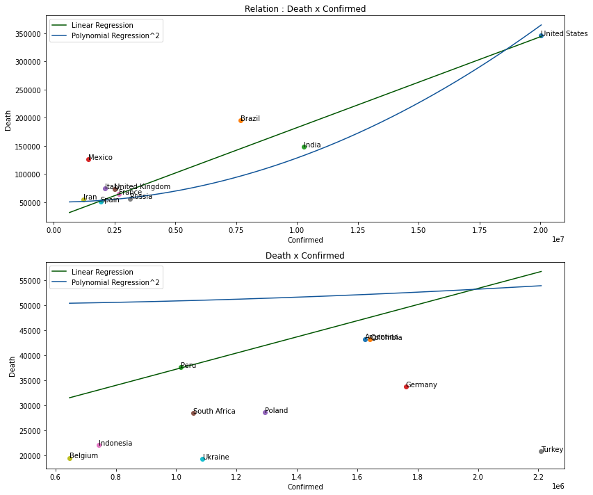
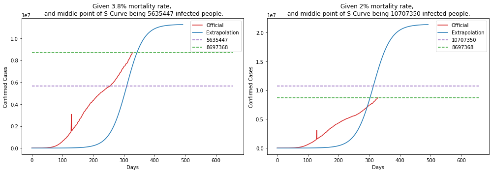
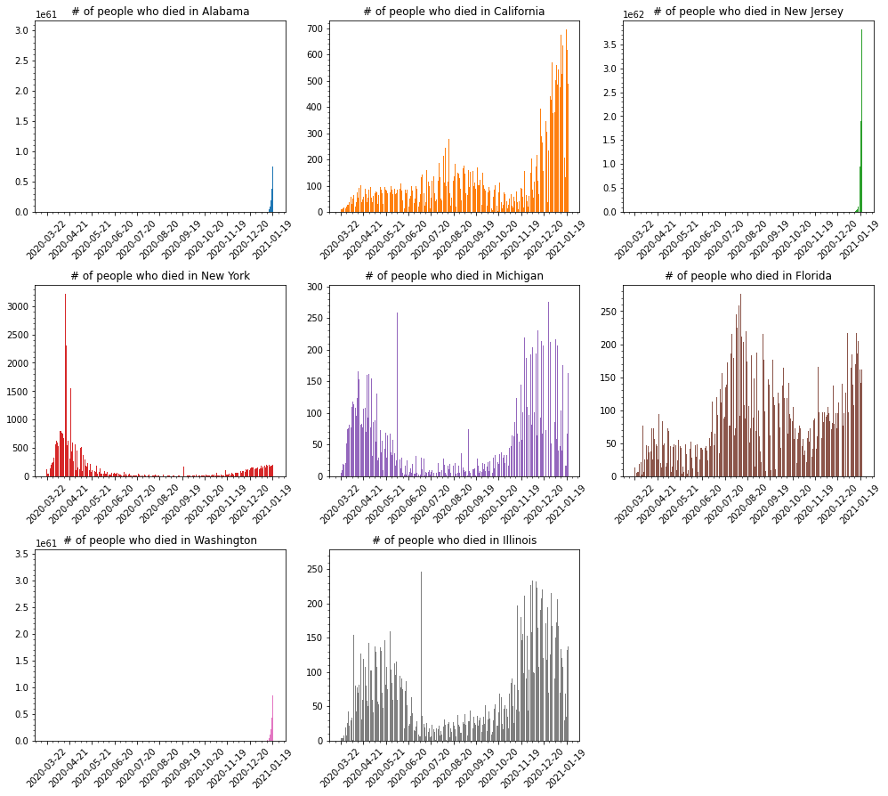

## COVID-19 Statistics

Simple repository to explore and show data about the new pandemic virus Corona Virus.

### Datasets

- World Data at: https://github.com/CSSEGISandData/COVID-19

- Brazil Data at: https://github.com/wcota/covid19br

- Brazil Population and other informations: https://www.ibge.gov.br/estatisticas/sociais/populacao.html

- World Population: https://www.worldometers.info/world-population/population-by-country/

- [Impact of non-pharmaceutical interventions (NPIs) to reduce COVID-19 mortality and healthcare demand](https://www.imperial.ac.uk/media/imperial-college/medicine/sph/ide/gida-fellowships/Imperial-College-COVID19-NPI-modelling-16-03-2020.pdf)

- [Vital Surveillances: The Epidemiological Characteristics of an Outbreak of 2019 Novel Coronavirus Diseases (COVID-19) — China, 2020](http://weekly.chinacdc.cn/en/article/id/e53946e2-c6c4-41e9-9a9b-fea8db1a8f51)


### Running notebook

In case you are running the notebook, do not forget to give a:

```bash
$> pip install -r requirements.txt
```

Download Firefox webdriver from https://github.com/mozilla/geckodriver/releases/tag/v0.26.0 to save the heatmap at the end.

### Statistics

#### 1. World data

    Last run: 2020-07-04 12:29:20.356966


    --------------------
    Confirmed cases stats:
    --------------------
    Mortality Rate : 4.88 %
    Recovered Rate : 51.1 %
    Confirmed Cases: 10475838
    Recovered      : 5353272
    Total Death    : 511253
    
    --------------------
    World Population stats:
    --------------------
    Confirmed Cases: 0.13794 %
    Mortality Rate : 0.00673 %


            Country  Confirmed  Deaths  Recovered  Mortality %  Population  Density/Pop  Urban/Pop %  Mortality/Pop %
      United States    2635417  127417     720631         4.83   331002651           36         0.83          0.03849
             Brazil    1402041   59594     788318         4.25   210147125           25         0.88          0.02836
             Russia     646929    9306     411973         1.44   145934462            9         0.74          0.00638
              India     585493   17400     347979         2.97  1380004385          464         0.35          0.00126
     United Kingdom     314160   43815       1370        13.95    67886011          281         0.83          0.06454
               Peru     285213    9677     174535         3.39    32971854           26         0.79          0.02935
              Chile     279393    5688     241229         2.04    19116201           26         0.85          0.02975
              Spain     249271   28355     150376        11.38    46754778           94         0.80          0.06065
              Italy     240578   34767     190248        14.45    60461826          206         0.69          0.05750
               Iran     227662   10817     188758         4.75    83992949           52         0.76          0.01288
             Mexico     226089   27769     174538        12.28   128932753           66         0.84          0.02154
           Pakistan     213470    4395     100802         2.06   220892340          287         0.35          0.00199
             France     202063   29846      76399        14.77    65273511          119         0.82          0.04572
             Turkey     199906    5131     173111         2.57    84339067          110         0.76          0.00608
            Germany     195418    8990     178100         4.60    83783942          240         0.76          0.01073
       Saudi Arabia     190823    1649     130766         0.86    34813871           16         0.84          0.00474
       South Africa     151209    2657      73543         1.76    59308690           49         0.67          0.00448
         Bangladesh     145483    1847      59624         1.27   164689383         1265         0.39          0.00112
             Canada     106097    8650      69120         8.15    37742154            4         0.81          0.02292
              Qatar      96088     113      81564         0.12     2881053          248         0.96          0.00392





---

The bellow graphics show the evolution of the desease over time for some countries.


#### Logarithmic Scale

Bellow some graphics in log scale of Confirmed cases for the above countries.


---

Predicting the pandemic of Corona Virus is hard, bellow is a simple demonstration of curve fitting, using 2 types (exponential and sigmoid) for estimation.


---

Another problem is not knowing the actual mortality for the disease.

The mortality for Covid-19 are said to be something like 3.8%, but previous calculations (based on data from China) put the mortality to be somthing like 2%... if this is truth, and looking at the mortality for Brazil, US and Italy, we should be able to extrapolate and calculate the possible real number of people who has the disease (been asyntomatic or not).

    BRAZIL
    --------------------
    Taking into account 3.8%, means that it should have 1568263 cases.
    Taking into account 2%, means that it should have 2979700 cases.





    UNITED STATES
    --------------------
    Taking into account 3.8%, means that it should have 3353078 cases.
    Taking into account 2%, means that it should have 6370850 cases.


    ITALY
    --------------------
    Taking into account 3.8%, means that it should have 914921 cases.
    Taking into account 2%, means that it should have 1738350 cases.


---


#### 2. Cases for US

Simple compilation of cases in United States.

    Province_State  Confirmed  Deaths  Mortality %
          New York     393454   32032         8.14
        California     231232    6082         2.63
        New Jersey     171667   15035         8.76
             Texas     163060    2455         1.51
           Florida     152434    3505         2.30
          Illinois     143185    6923         4.84
     Massachusetts     108882    8053         7.40
      Pennsylvania      91139    6649         7.30
           Georgia      81291    2805         3.45
           Arizona      79228    1645         2.08





---


#### 3. Cases for Brazil

Simple compilation of cases in Brazil.

For the entire Brazil, as of today, we have the following numbers:

    Mortality Rate     : 4.09 %
    Total Death        : 63305
    Confirmed Cases    : 1546007
    Mortality Rate/Pop : 0.03012 %


---

But, the story can't be told by the entire country, one must take into account, each state of the federation. Let's show data for each state in the federation.

                   UF  Total Cases  Deaths  Mortality %  Population  Mortality/Pop %
            São Paulo       310702   15694         5.05    45919049          0.03418
       Rio de Janeiro       118956   10500         8.83    17264943          0.06082
                Ceará       118311    6373         5.39     9132078          0.06979
                 Pará       112531    5069         4.50     8602865          0.05892
             Maranhão        88214    2153         2.44     7075181          0.03043
                Bahia        82314    2001         2.43    14873064          0.01345
             Amazonas        74537    2887         3.87     4144597          0.06966
           Pernambuco        62362    5068         8.13     9557071          0.05303
     Distrito Federal        53996     643         1.19     3015268          0.02132
         Minas Gerais        53351    1110         2.08    21168791          0.00524


Each state tells a different story, but what about the **capitals** for some of those states?


Bellow some possible projections for the next 10 days of infected people for each capital showed above.


---

Deaths in each capital are growing... let's visualize how deaths are spread across some cities.

                  City  Total Cases  Deaths  Mortality %
          São Paulo/SP       134984    7370         5.46
     Rio de Janeiro/RJ        58615    6689        11.41
          Fortaleza/CE        35899    3334         9.29
             Manaus/AM        28449    1826         6.42
           Salvador/BA        35837    1209         3.37
           Brasília/DF        53996     643         1.19
     Belo Horizonte/MG         7144     168         2.35
           Curitiba/PR         4828     160         3.31
       Porto Alegre/RS         2884     100         3.47


Much has been talked about that people in Brazil are young, so there's little risk for the population... but if we take into account that Brazil population is one of the biggest in the world and calculating death or hospitalization based on data provided by Imperial College and China CDC, Brazil could have more than 50k deaths. This is a simplistic view... it should take into account comorbidities to calculate those numbers.

    CDC China:
    --------------------
    Age (years)  Fatality Ratio %
            0-9               0.0
          10-19               0.2
          20-29               0.2
          30-39               0.2
          40-49               0.4
          50-59               1.3
          60-69               3.6
          70-79               8.0
             80              14.8


    Imperial College:
    --------------------
    Age (years)  % symptomatic cases (hospitalisation)  % hospitalised cases requiring critical care  Fatality Ratio %
            0-9                                    0.1                                           5.0             0.002
          10-19                                    0.3                                           5.0             0.006
          20-29                                    1.2                                           5.0             0.030
          30-39                                    3.2                                           5.0             0.080
          40-49                                    4.9                                           6.3             0.150
          50-59                                   10.2                                          12.2             0.600
          60-69                                   16.6                                          27.4             2.200
          70-79                                   24.3                                          43.2             5.100
             80                                   27.3                                          70.9             9.300


---

Given the above values **(from Imperial College and CDC China)** lets do a **projection of the possible** # of deaths in each **Age** group and given a possible interval of deaths that may occur.

       Age  Population  # Hospitalization  # Critical Care  # Deaths (Imperial College)  # Deaths (China CDC)
       0-9    29340464              29341             1468                            1                     0
     10-19    31089140              93268             4664                            1                    10
     20-29    34324757             411898            20595                            7                    42
     30-39    34130660            1092182            54610                           44                   110
     40-49    28689589            1405790            88565                          133                   355
     50-59    23477440            2394699           292154                         1753                  3799
     60-69    16173590            2684816           735640                        16185                 26484
     70-79     8654924            2103147           908560                        46337                 72685
        80     3492257             953387           675952                        62864                100041


                           Name  Min. Deaths  Max. Deaths
               Imperial College        25465       229185
                      CDC China        40705       366346
     Mean(Imperial + CDC China)        33085       297765


       Age  Min. Deaths  Max. Deaths
       0-9            0            0
     10-19            1            9
     20-29            4           44
     30-39           15          138
     40-49           48          439
     50-59          555         4996
     60-69         4266        38402
     70-79        11902       107119
        80        16290       146614


---


