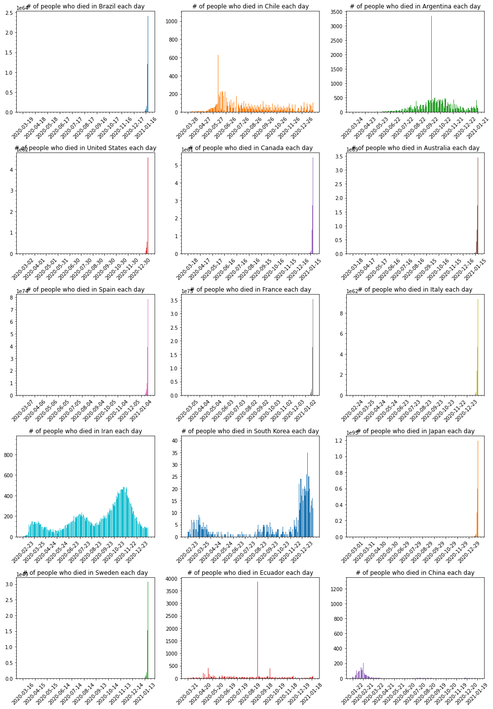
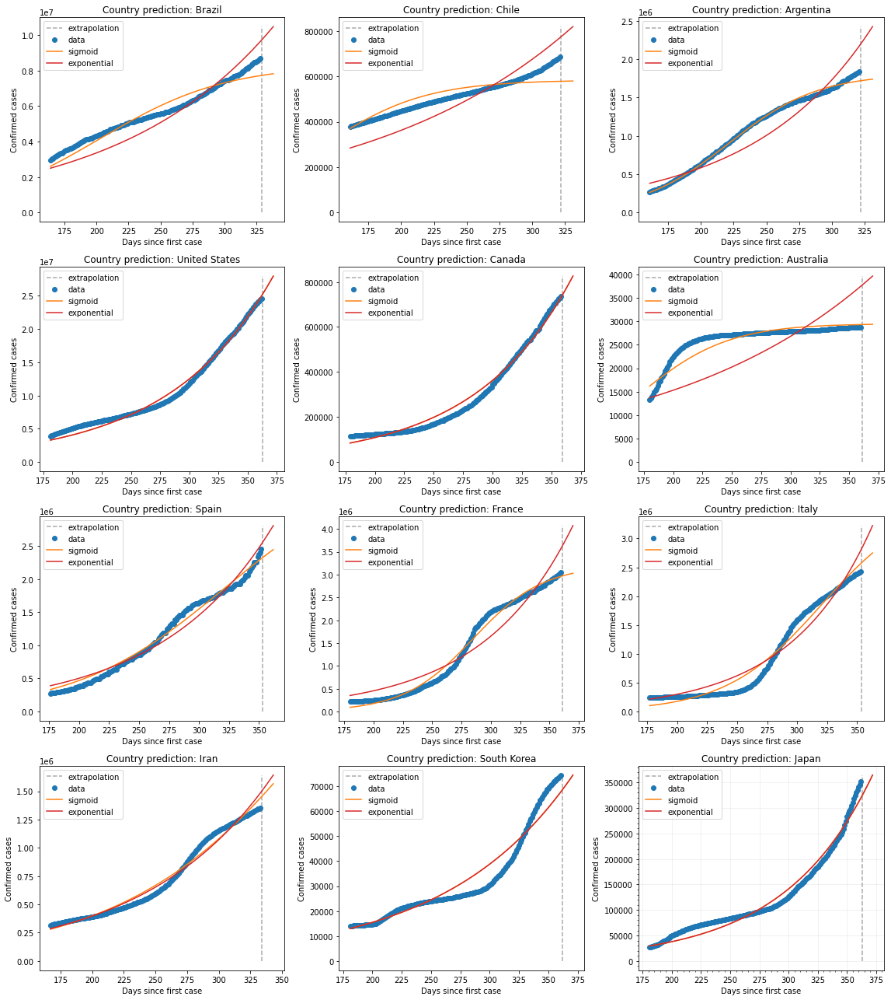

## COVID-19 Statistics

Simple repository to explore and show data about the new pandemic virus Corona Virus.

### Datasets

- World Data at: https://github.com/CSSEGISandData/COVID-19

- Brazil Data at: https://github.com/wcota/covid19br

- Brazil Population and other informations: https://www.ibge.gov.br/estatisticas/sociais/populacao.html

- World Population: https://www.worldometers.info/world-population/population-by-country/

- [Impact of non-pharmaceutical interventions (NPIs) to reduce COVID-19 mortality and healthcare demand](https://www.imperial.ac.uk/media/imperial-college/medicine/sph/ide/gida-fellowships/Imperial-College-COVID19-NPI-modelling-16-03-2020.pdf)

- [Vital Surveillances: The Epidemiological Characteristics of an Outbreak of 2019 Novel Coronavirus Diseases (COVID-19) — China, 2020](http://weekly.chinacdc.cn/en/article/id/e53946e2-c6c4-41e9-9a9b-fea8db1a8f51)


### Running notebook

In case you are running the notebook, do not forget to give a:

```bash
$> pip install -r requirements.txt
```

Download Firefox webdriver from https://github.com/mozilla/geckodriver/releases/tag/v0.26.0 to save the heatmap at the end.

### Statistics

#### 1. World data

    Last run: 2020-05-26 22:17:29.935116


    --------------------
    Confirmed cases stats:
    --------------------
    Mortality Rate : 6.3 %
    Recovered Rate : 40.61 %
    Confirmed Cases: 5495061
    Recovered      : 2231738
    Total Death    : 346232
    
    --------------------
    World Population stats:
    --------------------
    Confirmed Cases: 0.07236 %
    Mortality Rate : 0.00456 %


            Country  Confirmed  Deaths  Recovered  Mortality %  Population  Density/Pop  Urban/Pop %  Mortality/Pop %
      United States    1662302   98220     379157         5.91   331002651           36         0.83          0.02967
             Brazil     374898   23473     153833         6.26   210147125           25         0.88          0.01117
             Russia     353427    3633     118798         1.03   145934462            9         0.74          0.00249
     United Kingdom     262547   36996       1161        14.09    67886011          281         0.83          0.05450
              Spain     235400   26834     150376        11.40    46754778           94         0.80          0.05739
              Italy     230158   32877     141981        14.28    60461826          206         0.69          0.05438
             France     183067   28460      65317        15.55    65273511          119         0.82          0.04360
            Germany     180600    8309     161199         4.60    83783942          240         0.76          0.00992
             Turkey     157814    4369     120015         2.77    84339067          110         0.76          0.00518
              India     144950    4172      60706         2.88  1380004385          464         0.35          0.00030
               Iran     137724    7451     107713         5.41    83992949           52         0.76          0.00887
               Peru     123979    3629      50949         2.93    32971854           26         0.79          0.01101
             Canada      87119    6655      44651         7.64    37742154            4         0.81          0.01763
              China      84102    4638      79352         5.51  1439323776          153         0.61          0.00032
       Saudi Arabia      74795     399      45668         0.53    34813871           16         0.84          0.00115
              Chile      73997     761      29302         1.03    19116201           26         0.85          0.00398
             Mexico      71105    7633      49452        10.73   128932753           66         0.84          0.00592
            Belgium      57342    9312      15297        16.24    11589623          383         0.98          0.08035
           Pakistan      56349    1167      17482         2.07   220892340          287         0.35          0.00053
        Netherlands      45647    5849        174        12.81    17134872          508         0.92          0.03414


---

The bellow graphics show the evolution of the desease over time for some countries.


#### Logarithmic Scale

Bellow some graphics in log scale of Confirmed cases for the above countries.





---

Predicting the pandemic of Corona Virus is hard, bellow is a simple demonstration of curve fitting, using 2 types (exponential and sigmoid) for estimation.





---

Another problem is not knowing the actual mortality for the disease.

The mortality for Covid-19 are said to be something like 3.8%, but previous calculations (based on data from China) put the mortality to be somthing like 2%... if this is truth, and looking at the mortality for Brazil, US and Italy, we should be able to extrapolate and calculate the possible real number of people who has the disease (been asyntomatic or not).

    BRAZIL
    --------------------
    Taking into account 3.8%, means that it should have 617710 cases.
    Taking into account 2%, means that it should have 1173650 cases.


    UNITED STATES
    --------------------
    Taking into account 3.8%, means that it should have 2584736 cases.
    Taking into account 2%, means that it should have 4911000 cases.


    ITALY
    --------------------
    Taking into account 3.8%, means that it should have 865184 cases.
    Taking into account 2%, means that it should have 1643850 cases.


---


#### 2. Cases for US

Simple compilation of cases in United States.

    Province_State  Confirmed  Deaths  Mortality %
          New York     362764   29229         8.06
        New Jersey     155092   11147         7.19
          Illinois     112017    4885         4.36
        California      96400    3769         3.91
     Massachusetts      93271    6416         6.88
      Pennsylvania      71925    5146         7.15
             Texas      56409    1533         2.72
          Michigan      54881    5241         9.55
           Florida      51746    2252         4.35
          Maryland      47152    2302         4.88


---


#### 3. Cases for Brazil

Simple compilation of cases in Brazil.

For the entire Brazil, as of today, we have the following numbers:

    Mortality Rate     : 6.24 %
    Total Death        : 24616
    Confirmed Cases    : 394782
    Mortality Rate/Pop : 0.01171 %


---

But, the story can't be told by the entire country, one must take into account, each state of the federation. Let's show data for each state in the federation.

                 UF  Total Cases  Deaths  Mortality %  Population  Mortality/Pop %
          São Paulo        86017    6423         7.47    45919049          0.01399
     Rio de Janeiro        40024    4361        10.90    17264943          0.02526
              Ceará        37021    2603         7.03     9132078          0.02850
           Amazonas        31949    1852         5.80     4144597          0.04468
               Pará        29882    2522         8.44     8602865          0.02932
         Pernambuco        28854    2328         8.07     9557071          0.02436
           Maranhão        26145     853         3.26     7075181          0.01206
              Bahia        14566     495         3.40    14873064          0.00333
     Espírito Santo        10899     487         4.47     4018650          0.01212
            Paraíba         8919     286         3.21     4018127          0.00712


Each state tells a different story, but what about the **capitals** for some of those states?


Bellow some possible projections for the next 10 days of infected people for each capital showed above.


---

Deaths in each capital are growing... let's visualize how deaths are spread across some cities.

                  City  Total Cases  Deaths  Mortality %
          São Paulo/SP        47495    3691         7.77
     Rio de Janeiro/RJ        23283    2978        12.79
          Fortaleza/CE        20146    1769         8.78
             Manaus/AM        14402    1248         8.67
           Salvador/BA         8974     326         3.63
           Brasília/DF         7212     124         1.72
     Belo Horizonte/MG         1444      43         2.98
           Curitiba/PR          790      36         4.56
       Porto Alegre/RS          603      32         5.31


Much has been talked about that people in Brazil are young, so there's little risk for the population... but if we take into account that Brazil population is one of the biggest in the world and calculating death or hospitalization based on data provided by Imperial College and China CDC, Brazil could have more than 50k deaths. This is a simplistic view... it should take into account comorbidities to calculate those numbers.

    CDC China:
    --------------------
    Age (years)  Fatality Ratio %
            0-9               0.0
          10-19               0.2
          20-29               0.2
          30-39               0.2
          40-49               0.4
          50-59               1.3
          60-69               3.6
          70-79               8.0
             80              14.8


    Imperial College:
    --------------------
    Age (years)  % symptomatic cases (hospitalisation)  % hospitalised cases requiring critical care  Fatality Ratio %
            0-9                                    0.1                                           5.0             0.002
          10-19                                    0.3                                           5.0             0.006
          20-29                                    1.2                                           5.0             0.030
          30-39                                    3.2                                           5.0             0.080
          40-49                                    4.9                                           6.3             0.150
          50-59                                   10.2                                          12.2             0.600
          60-69                                   16.6                                          27.4             2.200
          70-79                                   24.3                                          43.2             5.100
             80                                   27.3                                          70.9             9.300


---

Given the above values **(from Imperial College and CDC China)** lets do a **projection of the possible** # of deaths in each **Age** group and given a possible interval of deaths that may occur.

       Age  Population  # Hospitalization  # Critical Care  # Deaths (Imperial College)  # Deaths (China CDC)
       0-9    29340464              29341             1468                            1                     0
     10-19    31089140              93268             4664                            1                    10
     20-29    34324757             411898            20595                            7                    42
     30-39    34130660            1092182            54610                           44                   110
     40-49    28689589            1405790            88565                          133                   355
     50-59    23477440            2394699           292154                         1753                  3799
     60-69    16173590            2684816           735640                        16185                 26484
     70-79     8654924            2103147           908560                        46337                 72685
        80     3492257             953387           675952                        62864                100041


                           Name  Min. Deaths  Max. Deaths
               Imperial College        25465       229185
                      CDC China        40705       366346
     Mean(Imperial + CDC China)        33085       297765


       Age  Min. Deaths  Max. Deaths
       0-9            0            0
     10-19            1            9
     20-29            4           44
     30-39           15          138
     40-49           48          439
     50-59          555         4996
     60-69         4266        38402
     70-79        11902       107119
        80        16290       146614


---


