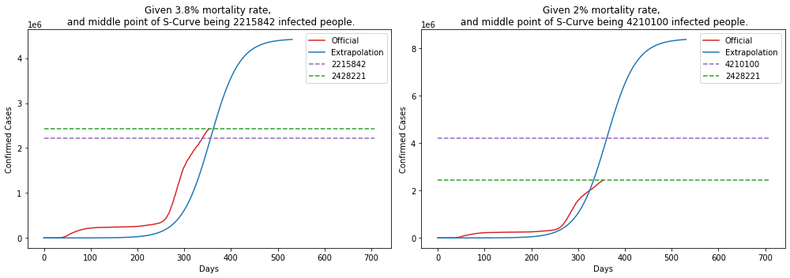
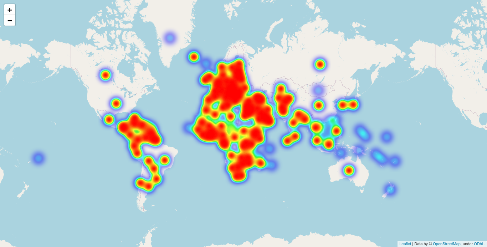
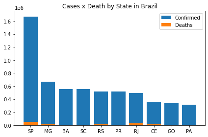
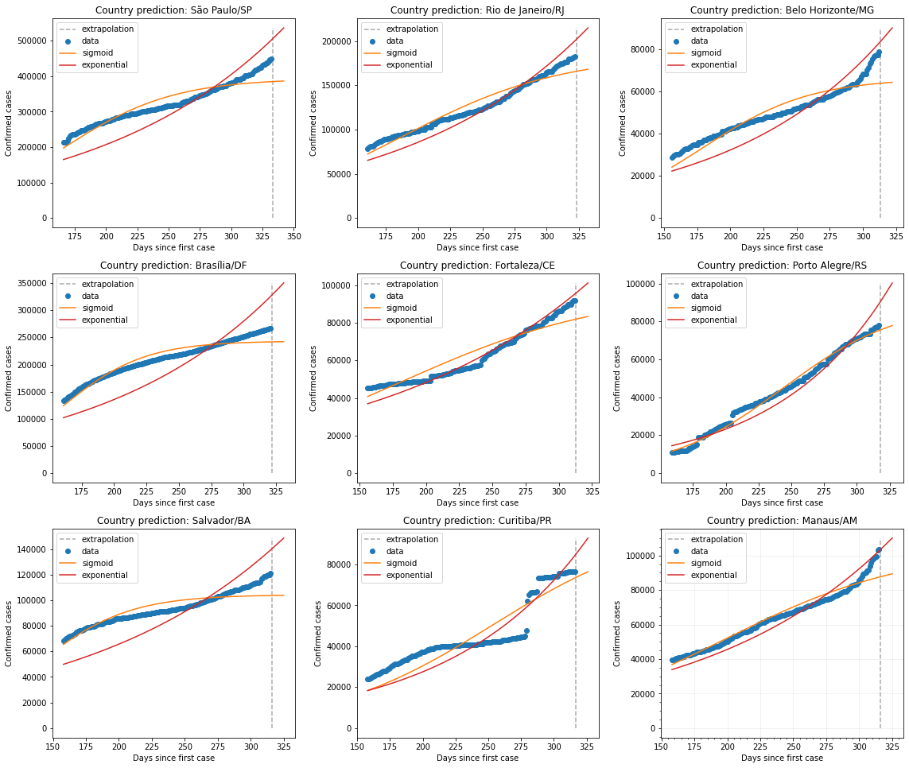
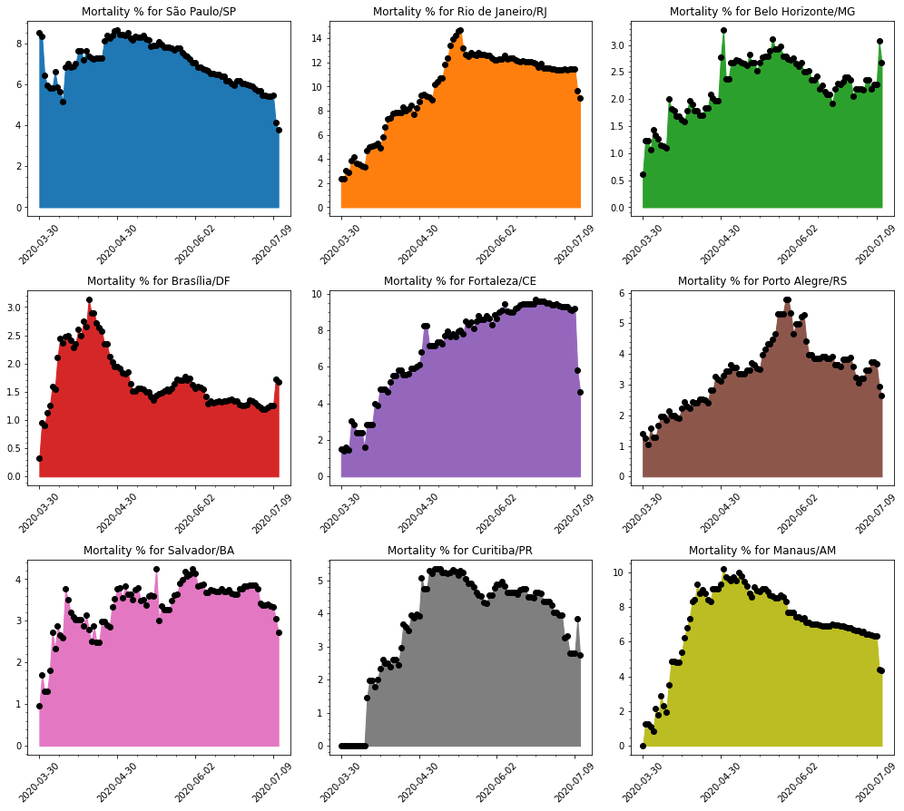
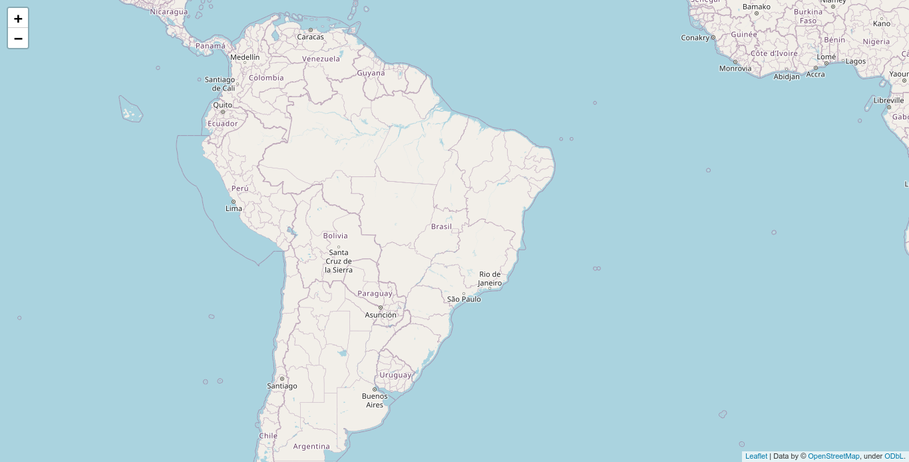

## COVID-19 Statistics

Simple repository to explore and show data about the new pandemic virus Corona Virus.

### Datasets

- World Data at: https://github.com/CSSEGISandData/COVID-19

- Brazil Data at: https://github.com/wcota/covid19br

- Brazil Population and other informations: https://www.ibge.gov.br/estatisticas/sociais/populacao.html

- World Population: https://www.worldometers.info/world-population/population-by-country/

- [Impact of non-pharmaceutical interventions (NPIs) to reduce COVID-19 mortality and healthcare demand](https://www.imperial.ac.uk/media/imperial-college/medicine/sph/ide/gida-fellowships/Imperial-College-COVID19-NPI-modelling-16-03-2020.pdf)

- [Vital Surveillances: The Epidemiological Characteristics of an Outbreak of 2019 Novel Coronavirus Diseases (COVID-19) — China, 2020](http://weekly.chinacdc.cn/en/article/id/e53946e2-c6c4-41e9-9a9b-fea8db1a8f51)


### Running notebook

In case you are running the notebook, do not forget to give a:

```bash
$> pip install -r requirements.txt
```

Download Firefox webdriver from https://github.com/mozilla/geckodriver/releases/tag/v0.26.0 to save the heatmap at the end.

### Statistics

#### 1. World data

    Last run: 2020-06-27 09:50:43.311181


    --------------------
    Confirmed cases stats:
    --------------------
    Mortality Rate : 5.12 %
    Recovered Rate : 50.33 %
    Confirmed Cases: 9430384
    Recovered      : 4746118
    Total Death    : 482752
    
    --------------------
    World Population stats:
    --------------------
    Confirmed Cases: 0.12418 %
    Mortality Rate : 0.00636 %


            Country  Confirmed  Deaths  Recovered  Mortality %  Population  Density/Pop  Urban/Pop %  Mortality/Pop %
      United States    2381361  121979     656161         5.12   331002651           36         0.83          0.03685
             Brazil    1188631   53830     660469         4.53   210147125           25         0.88          0.02562
             Russia     606043    8503     368222         1.40   145934462            9         0.74          0.00583
              India     473105   14894     271697         3.15  1380004385          464         0.35          0.00108
     United Kingdom     308337   43165       1345        14.00    67886011          281         0.83          0.06358
               Peru     264689    8586     151589         3.24    32971854           26         0.79          0.02604
              Chile     254416    4731     215093         1.86    19116201           26         0.85          0.02475
              Spain     247086   28327     150376        11.46    46754778           94         0.80          0.06059
              Italy     239410   34644     186111        14.47    60461826          206         0.69          0.05730
               Iran     212501    9996     172096         4.70    83992949           52         0.76          0.01190
             France     197885   29734      75251        15.03    65273511          119         0.82          0.04555
             Mexico     196847   24324     148487        12.36   128932753           66         0.84          0.01887
           Pakistan     192970    3903      81307         2.02   220892340          287         0.35          0.00177
            Germany     192871    8928     176422         4.63    83783942          240         0.76          0.01066
             Turkey     191657    5025     164234         2.62    84339067          110         0.76          0.00596
       Saudi Arabia     167267    1387     112797         0.83    34813871           16         0.84          0.00398
         Bangladesh     122660    1582      49666         1.29   164689383         1265         0.39          0.00096
       South Africa     111796    2205      56874         1.97    59308690           49         0.67          0.00372
             Canada     104087    8544      66533         8.21    37742154            4         0.81          0.02264
              Qatar      90778     104      73083         0.11     2881053          248         0.96          0.00361


---

The bellow graphics show the evolution of the desease over time for some countries.


#### Logarithmic Scale

Bellow some graphics in log scale of Confirmed cases for the above countries.


---

Predicting the pandemic of Corona Virus is hard, bellow is a simple demonstration of curve fitting, using 2 types (exponential and sigmoid) for estimation.


---

Another problem is not knowing the actual mortality for the disease.

The mortality for Covid-19 are said to be something like 3.8%, but previous calculations (based on data from China) put the mortality to be somthing like 2%... if this is truth, and looking at the mortality for Brazil, US and Italy, we should be able to extrapolate and calculate the possible real number of people who has the disease (been asyntomatic or not).

    BRAZIL
    --------------------
    Taking into account 3.8%, means that it should have 1416578 cases.
    Taking into account 2%, means that it should have 2691500 cases.


    UNITED STATES
    --------------------
    Taking into account 3.8%, means that it should have 3209973 cases.
    Taking into account 2%, means that it should have 6098950 cases.


    ITALY
    --------------------
    Taking into account 3.8%, means that it should have 911684 cases.
    Taking into account 2%, means that it should have 1732200 cases.





---





#### 2. Cases for US

Simple compilation of cases in United States.

    Province_State  Confirmed  Deaths  Mortality %
          New York     389666   31257         8.02
        California     195925    5725         2.92
        New Jersey     169892   13076         7.70
          Illinois     138540    6770         4.89
             Texas     128132    2270         1.77
           Florida     109014    3281         3.01
     Massachusetts     107611    7937         7.38
      Pennsylvania      87685    6518         7.43
           Georgia      69381    2698         3.89
          Michigan      68555    6114         8.92


---


#### 3. Cases for Brazil

Simple compilation of cases in Brazil.

For the entire Brazil, as of today, we have the following numbers:

    Mortality Rate     : 4.38 %
    Total Death        : 56110
    Confirmed Cases    : 1280513
    Mortality Rate/Pop : 0.0267 %


---

But, the story can't be told by the entire country, one must take into account, each state of the federation. Let's show data for each state in the federation.

                 UF  Total Cases  Deaths  Mortality %  Population  Mortality/Pop %
          São Paulo       258508   13966         5.40    45919049          0.03041
     Rio de Janeiro       108497    9587         8.84    17264943          0.05553
              Ceará       105270    5962         5.66     9132078          0.06529
               Pará        99313    4834         4.87     8602865          0.05619
           Maranhão        76698    1906         2.49     7075181          0.02694
           Amazonas        68220    2739         4.01     4144597          0.06609
              Bahia        56422    1642         2.91    14873064          0.01104
         Pernambuco        55804    4610         8.26     9557071          0.04824
            Paraíba        42832     864         2.02     4018127          0.02150
     Espírito Santo        41652    1507         3.62     4018650          0.03750





Each state tells a different story, but what about the **capitals** for some of those states?


Bellow some possible projections for the next 10 days of infected people for each capital showed above.





---

Deaths in each capital are growing... let's visualize how deaths are spread across some cities.

                  City  Total Cases  Deaths  Mortality %
          São Paulo/SP       121163    6880         5.68
     Rio de Janeiro/RJ        55152    6264        11.36
          Fortaleza/CE        34027    3212         9.44
             Manaus/AM        26783    1747         6.52
           Salvador/BA        27666    1046         3.78
           Brasília/DF        41326     532         1.29
           Curitiba/PR         3093     122         3.94
     Belo Horizonte/MG         4977     109         2.19
       Porto Alegre/RS         2383      76         3.19





Much has been talked about that people in Brazil are young, so there's little risk for the population... but if we take into account that Brazil population is one of the biggest in the world and calculating death or hospitalization based on data provided by Imperial College and China CDC, Brazil could have more than 50k deaths. This is a simplistic view... it should take into account comorbidities to calculate those numbers.

    CDC China:
    --------------------
    Age (years)  Fatality Ratio %
            0-9               0.0
          10-19               0.2
          20-29               0.2
          30-39               0.2
          40-49               0.4
          50-59               1.3
          60-69               3.6
          70-79               8.0
             80              14.8


    Imperial College:
    --------------------
    Age (years)  % symptomatic cases (hospitalisation)  % hospitalised cases requiring critical care  Fatality Ratio %
            0-9                                    0.1                                           5.0             0.002
          10-19                                    0.3                                           5.0             0.006
          20-29                                    1.2                                           5.0             0.030
          30-39                                    3.2                                           5.0             0.080
          40-49                                    4.9                                           6.3             0.150
          50-59                                   10.2                                          12.2             0.600
          60-69                                   16.6                                          27.4             2.200
          70-79                                   24.3                                          43.2             5.100
             80                                   27.3                                          70.9             9.300


---

Given the above values **(from Imperial College and CDC China)** lets do a **projection of the possible** # of deaths in each **Age** group and given a possible interval of deaths that may occur.

       Age  Population  # Hospitalization  # Critical Care  # Deaths (Imperial College)  # Deaths (China CDC)
       0-9    29340464              29341             1468                            1                     0
     10-19    31089140              93268             4664                            1                    10
     20-29    34324757             411898            20595                            7                    42
     30-39    34130660            1092182            54610                           44                   110
     40-49    28689589            1405790            88565                          133                   355
     50-59    23477440            2394699           292154                         1753                  3799
     60-69    16173590            2684816           735640                        16185                 26484
     70-79     8654924            2103147           908560                        46337                 72685
        80     3492257             953387           675952                        62864                100041


                           Name  Min. Deaths  Max. Deaths
               Imperial College        25465       229185
                      CDC China        40705       366346
     Mean(Imperial + CDC China)        33085       297765


       Age  Min. Deaths  Max. Deaths
       0-9            0            0
     10-19            1            9
     20-29            4           44
     30-39           15          138
     40-49           48          439
     50-59          555         4996
     60-69         4266        38402
     70-79        11902       107119
        80        16290       146614


---





