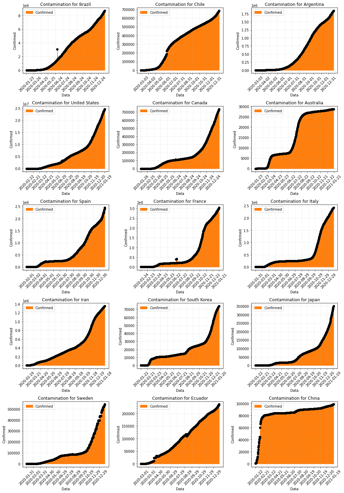
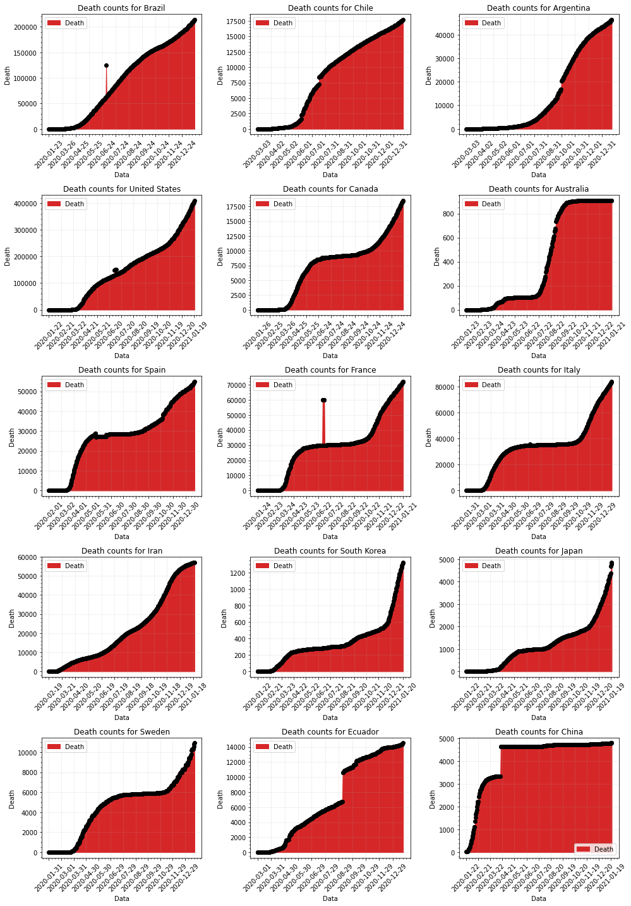
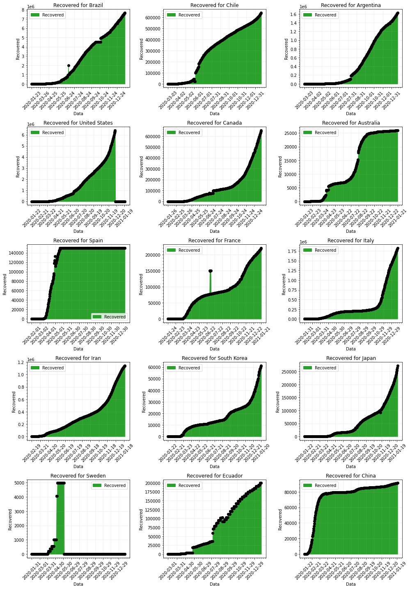
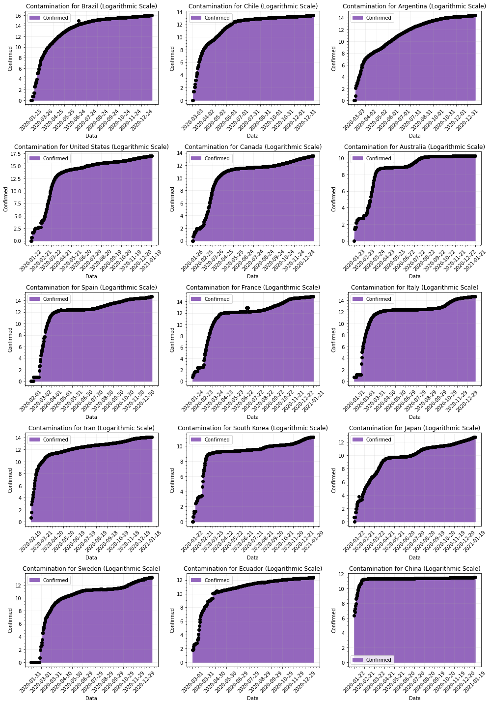
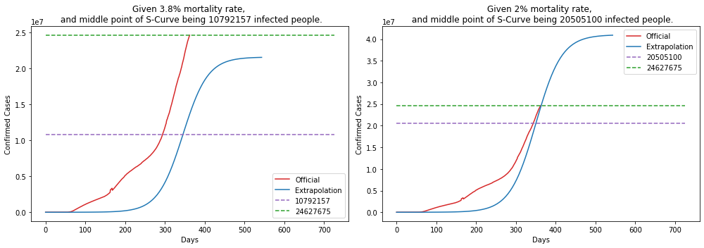
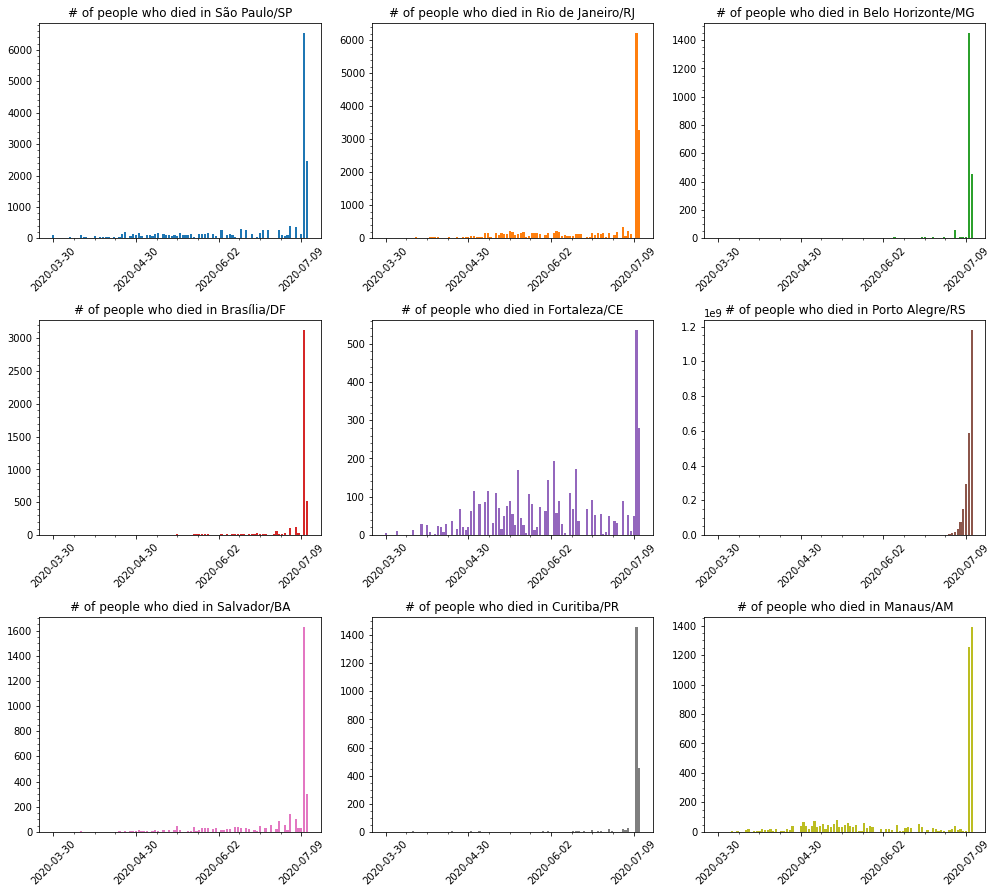

## COVID-19 Statistics

Simple repository to explore and show data about the new pandemic virus Corona Virus.

### Datasets

- World Data at: https://github.com/CSSEGISandData/COVID-19

- Brazil Data at: https://github.com/wcota/covid19br

- Brazil Population and other informations: https://www.ibge.gov.br/estatisticas/sociais/populacao.html

- World Population: https://www.worldometers.info/world-population/population-by-country/

- [Impact of non-pharmaceutical interventions (NPIs) to reduce COVID-19 mortality and healthcare demand](https://www.imperial.ac.uk/media/imperial-college/medicine/sph/ide/gida-fellowships/Imperial-College-COVID19-NPI-modelling-16-03-2020.pdf)

- [Vital Surveillances: The Epidemiological Characteristics of an Outbreak of 2019 Novel Coronavirus Diseases (COVID-19) — China, 2020](http://weekly.chinacdc.cn/en/article/id/e53946e2-c6c4-41e9-9a9b-fea8db1a8f51)


### Running notebook

In case you are running the notebook, do not forget to give a:

```bash
$> pip install -r requirements.txt
```

Download Firefox webdriver from https://github.com/mozilla/geckodriver/releases/tag/v0.26.0 to save the heatmap at the end.

### Statistics

#### 1. World data

    Last run: 2021-01-22 13:10:48.648656


    --------------------
    Confirmed cases stats:
    --------------------
    Mortality Rate : 2.18 %
    Recovered Rate : 56.31 %
    Confirmed Cases: 83488443
    Recovered      : 47010049
    Total Death    : 1818336
    
    --------------------
    World Population stats:
    --------------------
    Confirmed Cases: 1.09925 %
    Mortality Rate : 0.02394 %


           Country  Confirmed  Deaths  Recovered  Mortality %  Population  Density/Pop  Urban/Pop %  Mortality/Pop %
     United States   20032035  345955          0         1.73   331002651           36         0.83          0.10452
            Brazil    7675973  194949    6848844         2.54   210147125           25         0.88          0.09277
             India   10266674  148738    9860280         1.45  1380004385          464         0.35          0.01078
            Mexico    1426094  125807    1074795         8.82   128932753           66         0.84          0.09758
             Italy    2107166   74159    1463111         3.52    60461826          206         0.69          0.12265
    United Kingdom    2496231   73622       5479         2.95    67886011          281         0.83          0.10845
            France    2677666   64759     200142         2.42    65273511          119         0.82          0.09921
            Russia    3127347   56271    2527722         1.80   145934462            9         0.74          0.03856
              Iran    1225142   55223     988833         4.51    83992949           52         0.76          0.06575
             Spain    1928265   50837     150376         2.64    46754778           94         0.80          0.10873
         Argentina    1625514   43245    1426676         2.66    45195774           17         0.93          0.09568
          Colombia    1642775   43213    1508419         2.63    50882891           46         0.80          0.08493
              Peru    1015137   37680     951318         3.71    32971854           26         0.79          0.11428
           Germany    1760520   33791    1350708         1.92    83783942          240         0.76          0.04033
            Poland    1294878   28554    1036138         2.21    37846611          124         0.60          0.07545
      South Africa    1057161   28469     879671         2.69    59308690           49         0.67          0.04800
         Indonesia     743198   22138     611097         2.98   273523615          151         0.56          0.00809
            Turkey    2208652   20881    2100650         0.95    84339067          110         0.76          0.02476
           Belgium     646496   19528          0         3.02    11589623          383         0.98          0.16850
           Ukraine    1086997   19281     736611         1.77    43733762           75         0.69          0.04409


    

    


    

    


---

The bellow graphics show the evolution of the desease over time for some countries.


    

    


    

    


    

    


    

    


#### Logarithmic Scale

Bellow some graphics in log scale of Confirmed cases for the above countries.


    

    


    

    


---

Predicting the pandemic of Corona Virus is hard, bellow is a simple demonstration of curve fitting, using 2 types (exponential and sigmoid) for estimation.


    

    


---

Another problem is not knowing the actual mortality for the disease.

The mortality for Covid-19 are said to be something like 3.8%, but previous calculations (based on data from China) put the mortality to be somthing like 2%... if this is truth, and looking at the mortality for Brazil, US and Italy, we should be able to extrapolate and calculate the possible real number of people who has the disease (been asyntomatic or not).

    BRAZIL
    --------------------
    Taking into account 3.8%, means that it should have 5635447 cases.
    Taking into account 2%, means that it should have 10707350 cases.


    

    


    UNITED STATES
    --------------------
    Taking into account 3.8%, means that it should have 10792157 cases.
    Taking into account 2%, means that it should have 20505100 cases.


    

    


    ITALY
    --------------------
    Taking into account 3.8%, means that it should have 2215842 cases.
    Taking into account 2%, means that it should have 4210100 cases.


    

    


---


    

    


#### 2. Cases for US

Simple compilation of cases in United States.

    Province_State  Confirmed  Deaths  Mortality %
        California    2297039   25986         1.13
             Texas    1772784   28066         1.58
           Florida    1323315   21673         1.64
          New York     978783   37983         3.88
          Illinois     963389   17978         1.87
              Ohio     700380    8962         1.28
           Georgia     666452   10934         1.64
      Pennsylvania     645390   15947         2.47
         Tennessee     586802    6907         1.18
    North Carolina     539545    6748         1.25


    

    


---


    

    


#### 3. Cases for Brazil

Simple compilation of cases in Brazil.

For the entire Brazil, as of today, we have the following numbers:

    Mortality Rate     : 2.46 %
    Total Death        : 214317
    Confirmed Cases    : 8704658
    Mortality Rate/Pop : 0.10198 %


---

But, the story can't be told by the entire country, one must take into account, each state of the federation. Let's show data for each state in the federation.

                   UF  Total Cases  Deaths  Mortality %  Population  Mortality/Pop %
            São Paulo      1670754   50938         3.05    45919049          0.11093
         Minas Gerais       668216   13891         2.08    21168791          0.06562
                Bahia       553770    9760         1.76    14873064          0.06562
       Santa Catarina       552310    6036         1.09     7164788          0.08425
    Rio Grande do Sul       520313   10196         1.96    11377239          0.08962
               Paraná       515464    9243         1.79    11433957          0.08084
       Rio de Janeiro       494127   28440         5.76    17264943          0.16473
                Ceará       359678   10299         2.86     9132078          0.11278
                Goiás       335665    7226         2.15     7018354          0.10296
                 Pará       316176    7470         2.36     8602865          0.08683


    

    


Each state tells a different story, but what about the **capitals** for some of those states?


    

    


Bellow some possible projections for the next 10 days of infected people for each capital showed above.


    

    


---

Deaths in each capital are growing... let's visualize how deaths are spread across some cities.

                 City  Total Cases  Deaths  Mortality %
         São Paulo/SP       448744   16855         3.76
    Rio de Janeiro/RJ       182713   16543         9.05
            Manaus/AM       103787    4502         4.34
          Brasília/DF       267340    4452         1.67
         Fortaleza/CE        91793    4262         4.64
          Salvador/BA       120897    3300         2.73
    Belo Horizonte/MG        78822    2104         2.67
          Curitiba/PR        76530    2101         2.75
      Porto Alegre/RS        77924    2048         2.63


    

    


    

    


Much has been talked about that people in Brazil are young, so there's little risk for the population... but if we take into account that Brazil population is one of the biggest in the world and calculating death or hospitalization based on data provided by Imperial College and China CDC, Brazil could have more than 50k deaths. This is a simplistic view... it should take into account comorbidities to calculate those numbers.

    CDC China:
    --------------------
    Age (years)  Fatality Ratio %
            0-9               0.0
          10-19               0.2
          20-29               0.2
          30-39               0.2
          40-49               0.4
          50-59               1.3
          60-69               3.6
          70-79               8.0
             80              14.8


    Imperial College:
    --------------------
    Age (years)  % symptomatic cases (hospitalisation)  % hospitalised cases requiring critical care  Fatality Ratio %
            0-9                                    0.1                                           5.0             0.002
          10-19                                    0.3                                           5.0             0.006
          20-29                                    1.2                                           5.0             0.030
          30-39                                    3.2                                           5.0             0.080
          40-49                                    4.9                                           6.3             0.150
          50-59                                   10.2                                          12.2             0.600
          60-69                                   16.6                                          27.4             2.200
          70-79                                   24.3                                          43.2             5.100
             80                                   27.3                                          70.9             9.300


---

Given the above values **(from Imperial College and CDC China)** lets do a **projection of the possible** # of deaths in each **Age** group and given a possible interval of deaths that may occur.

      Age  Population  # Hospitalization  # Critical Care  # Deaths (Imperial College)  # Deaths (China CDC)
      0-9    29340464              29341             1468                            1                     0
    10-19    31089140              93268             4664                            1                    10
    20-29    34324757             411898            20595                            7                    42
    30-39    34130660            1092182            54610                           44                   110
    40-49    28689589            1405790            88565                          133                   355
    50-59    23477440            2394699           292154                         1753                  3799
    60-69    16173590            2684816           735640                        16185                 26484
    70-79     8654924            2103147           908560                        46337                 72685
       80     3492257             953387           675952                        62864                100041


                          Name  Min. Deaths  Max. Deaths
              Imperial College        25465       229185
                     CDC China        40705       366346
    Mean(Imperial + CDC China)        33085       297765


      Age  Min. Deaths  Max. Deaths
      0-9            0            0
    10-19            1            9
    20-29            4           44
    30-39           15          138
    40-49           48          439
    50-59          555         4996
    60-69         4266        38402
    70-79        11902       107119
       80        16290       146614


---


    

    


